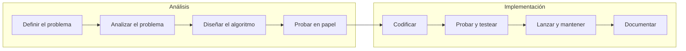
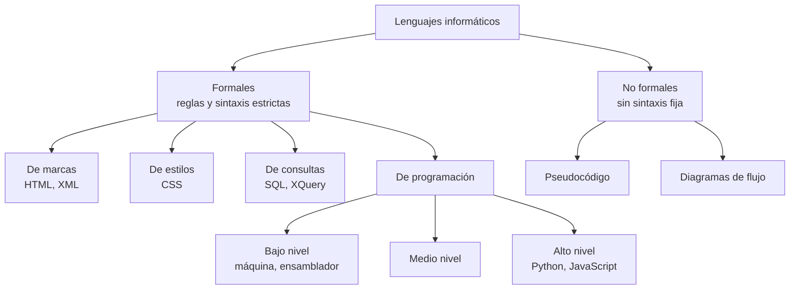

# Tema 1 · Lenguajes de programación

[← Volver al índice](../README.md)

## ¿Qué es programar?

Programar es diseñar y organizar una serie de instrucciones (un **algoritmo**) para que un dispositivo realice una tarea concreta. Ese algoritmo, escrito en un lenguaje que la máquina puede ejecutar, es lo que hay detrás de cualquier aplicación, web o sistema.

## Fases de la programación

Todo programa pasa por dos grandes bloques: **análisis** (entender el problema y diseñar la solución) e **implementación** (convertir esa solución en código que funcione). Saltarse el análisis es la causa más habitual de programas mal planteados.



| Fase | Qué se hace |
|---|---|
| Definir el problema | Entender exactamente qué se quiere resolver, sin ambigüedades |
| Analizar el problema | Recopilar la información necesaria (entradas, salidas) e identificar restricciones |
| Diseñar el algoritmo | Plantear la solución paso a paso, en pseudocódigo o diagrama de flujo |
| Probar la solución en papel | Comprobar que la lógica funciona antes de programarla |
| Codificar | Traducir el algoritmo a un lenguaje de programación |
| Probar y testear | Ejecutar el programa y corregir errores de sintaxis, de ejecución o de lógica |
| Lanzar y mantener | Publicar el programa y seguir corrigiéndolo y mejorándolo |
| Documentar | Dejar por escrito cómo funciona, para quien lo use o lo continúe |

## Lenguajes informáticos

Un lenguaje informático permite expresar instrucciones para un sistema.



- **De marcas** (HTML, XML): estructuran contenido con etiquetas.
- **De estilos** (CSS): definen la presentación visual de ese contenido.
- **De consultas** (SQL, XQuery): permiten interrogar bases de datos o recuperar información.
- **De programación**: permiten crear software. Cuanto más alto es el nivel, más se parece al lenguaje humano y más se aleja del hardware.

## Pseudocódigo

El pseudocódigo describe un algoritmo en lenguaje casi natural, sin atarse a la sintaxis de ningún lenguaje concreto. Es la herramienta que usaremos todo el curso para diseñar la lógica **antes** de programarla en Python.

```text
INICIO
    // Riego automático de un huerto (caso práctico del libro)
    CONSTANTES: UMBRAL_HUMEDAD = 30
    LEER humedad
    SI humedad < UMBRAL_HUMEDAD ENTONCES
        ESCRIBIR "Activar bomba de agua"
    SINO
        ESCRIBIR "No es necesario regar"
    FIN SI
FIN
```

Convenciones: `INICIO`/`FIN`, `CONSTANTES:`, `LEER` (entrada), `ESCRIBIR` (salida), `SI ... ENTONCES ... SINO ... FIN SI`, `//` para comentarios, una instrucción por línea y sangría dentro de cada bloque.

## Enlace de interés

- [Mapa del Empleo de Fundación Telefónica](https://mapadelempleo.fundaciontelefonica.com/): perfiles y habilidades digitales más demandados.
