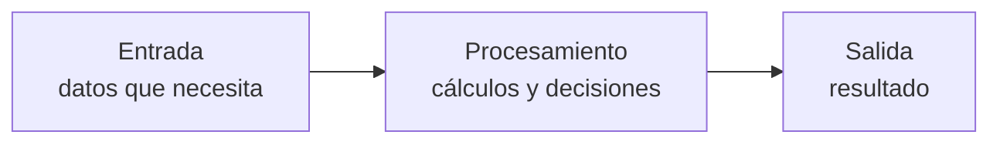
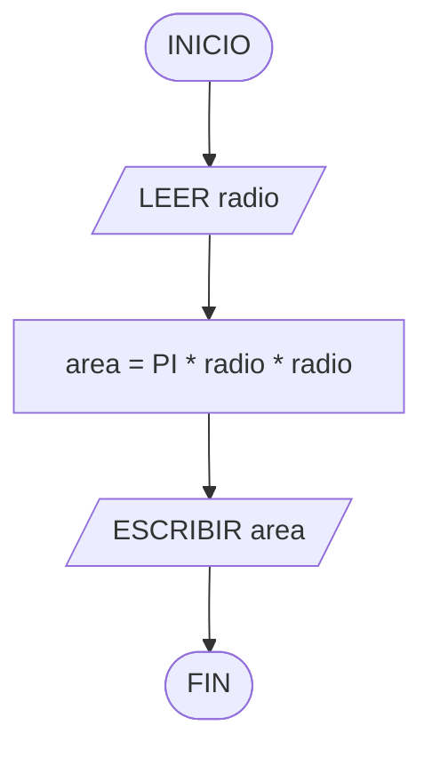

# Tema 3 · Conceptos avanzados de la programación general y algoritmos

[← Volver al índice](../README.md)

## Estructuras de control de flujo (adelanto)

Son las instrucciones que **alteran el orden secuencial**: los condicionales (hacer algo solo si se cumple una condición) y los bucles (repetir). Aquí solo se presentan como concepto; se programan en Python en el Tema 5.

## Funciones

Una función agrupa líneas de código que realizan una tarea concreta, para invocarlas por su nombre en lugar de repetir el código.

- **Predeterminadas**: vienen con el lenguaje (`print`, `round`, `len`...).
- **Personalizadas**: las define el programador.

Toda función debe **definirse antes de invocarse**, y su nombre va siempre seguido de paréntesis, aunque no reciba parámetros.

```python
def precio_con_descuento(precio, descuento):   # definición
    return precio - precio * descuento / 100   # return devuelve el resultado

total = precio_con_descuento(80, 25)           # invocación
print(total)                                   # 60.0
```

Ver [`ejemplos/funciones.py`](ejemplos/funciones.py).

## Programación Orientada a Objetos (POO)

La POO organiza el código en torno a **clases** y **objetos**:

| Concepto | Qué es | Ejemplo |
|---|---|---|
| Clase | La plantilla: define atributos y métodos | `Servidor` |
| Atributo | Un dato que tiene cada objeto | `nombre`, `ip`, `ram_gb` |
| Método | Una acción que puede hacer cada objeto | `arrancar()`, `apagar()` |
| Objeto | Una instancia concreta de la clase, con sus propios valores | `srv-web01` con IP `192.168.10.10` |

Se retoma en profundidad, ya programando, en el Tema 9.

## Algoritmos

Un algoritmo es una secuencia **finita, precisa y ordenada** de instrucciones para resolver un problema. Todo algoritmo tiene tres fases:



### Representación

**Pseudocódigo** (visto en el Tema 1) y **diagrama de flujo**, que usa figuras normalizadas y se lee de arriba abajo:

| Figura | Significado |
|---|---|
| Óvalo | Inicio / fin |
| Paralelogramo | Entrada / salida de datos |
| Rectángulo | Proceso (cálculo, asignación) |
| Rombo | Decisión (pregunta con Sí / No) |

Ejemplo: área de un círculo.



## En una frase

- **T1**: programar es diseñar algoritmos siguiendo unas fases (análisis + implementación).
- **T2**: todo algoritmo se apoya en tipos de datos, variables/constantes y operadores; en Python la indentación es obligatoria.
- **T3**: funciones, POO y algoritmos (entrada, procesamiento y salida, en pseudocódigo o diagrama de flujo) son el vocabulario de todo el curso.
